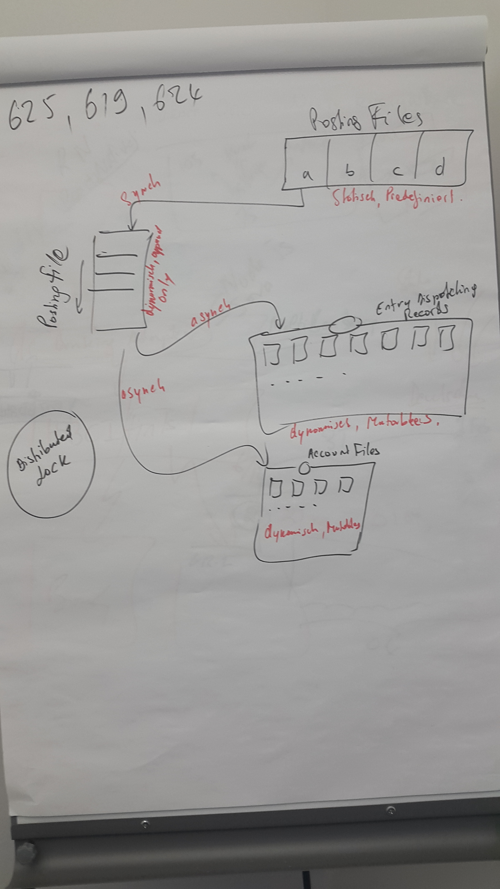

* ACID vs BASE innerhalb des DFS betrachten
* Was kostet ein Append an ein File
* NATSD Messaging Software vielleicht als Load Balancer?
* Das System muss in die Bank eingegliedert werden! API
* Banken mehr IT Unternehmen als Facebook etc.
* Read only Datei System als Abbild von Konto System
* Wieso keine NoSQL Datenbank sondern ein DFS? Was sind die unterschiede?
* Amazon Dynamo
* Grid Computing
* Austauschbare Speicherschicht
* DFS vs NoSQL Anfragen an Verwaltungs node und dann an Backendnode entgegen falschenhals
* Jede Abstaktion ist auf Laufzeit veränderung

# Aldi Einkauf

* Aldi karten Tool
	* Bezahldienstleister (First Data)
		* Standort des gerätes bekannt
		* ließt meine Kontonummer, BLZ
		* Anfrage an First Data (Debit Anfrage an Bank)
		* Saldo Prüfung, Authorisierungsanfrage
		* First Data antwortet Gerät ob Möglich oder nicht
		* Drucken der Rechnung, Transaktion an First Data
	* First Data schickt im batch asynchron Posting an Banken der Beteiligten (Datenträgeraustausch DTA, heute  SEPA-Dateien alle Postings einer Bank)
* SEPA Dateien im Buchungssystem der Bank verarbeiten
* Zahlungsverkehr Programm (CBS Zahlungsverkehrmodul)
Einführung (3 Seiten)
==========

## Motivation
* Banken sind Big Data (Hier brauche ich noch Infos!!!)
	* Kreditanträge
	* Kontoumsätze
	* Wo kommen all diese Daten her?
		* Online und Mobile Banking
		* Auch  der Einsatz von Banking APIs ermöglicht drittanbieter apps auf die Daten der Banken zuzugreifen und auch neue zu generieren.
		* Die Vielzahl an Verwendungsmöglichkeiten erhöht natürlich die Datenmenge
	* Probelm ist jedoch, dass die eingesetzte Technologie nicht hinterherkommt
		* Veraltete Kernbankensysteme
		* Die Systeme müssen hohe Bedingungen erfüllen, daher ist ein Wechsel schwierig
		* Alte Kernbankensysteme bremsen Fortschritt aus
	* Was sind die Herausforderungen, die es zu bewältigen gilt?
		* Analyse der Daten
		* Skalierung der Systeme
		* Kostenprobleme Speicher und Hardware kostet
		* Anfragen der Kunden bewältigen
		* Die Architektur muss entsprechend angepasst werden
		* Kernbankensysteme sind nicht darauf ausgerichtet
	* Welche VOrteile bringt uns Big Data im Bankensektor?
		* Erkennen von ungewöhnlichen Transaktionen
		* Für Kundenzugeschnittene Angebote
		* Kreditwürdigkeit und Risiko analyse wird genauer
		* Welcher Finanzsektor ist am Wachsen, beziehungswiese interessant
* Wie haben andere das Problem gelöst?
	* Firmen wie Google, Yahoo oder Facebook haben das gleiche Problem
	* Was genau hat Sharing Economy mit dem ganzen Thema zu tun?
	* Anwendung von einem DFS auf die Banking Welt.

## Umfeld
* In wie weit sich die Sharing Economy durch den Einsatz eines Distributed File Systems auf ein Banking Buchungsystem übertragen lässt soll in dieser Arbeit bearbeitet werden
* Partner ist hierbei adorsys
* IT Consulting Firma, welche selbst einige Kunden im Versucherungs und Finanz sektor hat
* Beispielsweise Easy Credit wurde mit adorsys umgesetzt
* Desweiteren war auch die Umsetzung eines Open Source Kernbankensystems durch adorsys geplant

## Zielsetzung
* Relationale Datenbanken sind mit die ältesten Systeme
	* Steuern die Art wie Systeme gebaut sind
	* Doch Transaktionen und Indizes werden vielleicht auch gar nicht immer gebraucht
* Rausfinden Welche Teile eines Buchungssystems sich  durch ein Distributed File System realisieren lassen
* Methriken finden um die Ergebnisse zu Messen
* Es sollen weitestgehend alle Anforderungen eines Buchungssystems realisiert werden können
* Kostenersparnis sichtbar machen (Nur wie!!!!!!)
* Durch Anpassen der Achitektur auf die Bedürfnisse kann Speicher und Rechenzeit sehr flexibel berechnet werden
* Daraus folgt ein wirtschaftlicher Vorteil
	* Kernbankensysteme müssen je nach Model unterschiedlich abkassieren
		* Leasing, Miete, pro Transaktion etc.
	* Kostenersparnis bei Servern
	* Kostenersparnis bei Speicher
	* Diese Ersparnis fällt im besten Fall sogar auf den Kunden zurück
	* Banken müssen sich den neuen Herausforderungen stellen
		* Sharing Economy und Fin Techs sind Konkurrenten
* Was zusätzlich noch mitkommt ist eine beliebige Skalierbarkeit und Ausfallsicherheit
	* Und bessere Performance

* Nicht im Rahmen der aktuellen Technologie denken, sondern Anfiorderungen hinterfragen(Vielleicht auch Motvation)
* Stark transaktionsbasiertes System nach echten Anforderungen hinterfragen
* Bessere Skalierbarkeit, Ausfallsicherheit und Performance
* Beantwortung der Frage ob ein Buchungssystem bzw. welche Teile/ Konten lassen sich realisieren
* Was bringt es mir tatsächlich das ganze umzusetzen

	* Könnten auch Faktoren zur Methodik sein
		* Infrastruktur
		* Data Storage
		* Data Processing and Management
		* Data Analytics

Vorgehen (2 - 3 Seiten)
========

Eher analytisch weniger Empirisch
Weil wir keine Bankendaten haben
* Es gibt nur wenige Informationen über die Architektur von Banken
	* Datenmenge
	* Transaktionen pro Tag, Jahr
	* Maßnahmen zur Erneuerung der Kernbanken systeme

## Analyse der Ist-Situation (Nur Vorgehensweise erläutern)
* Banken reden nicht sehr detailiert über die Grenzen ihrer KBS, aber die Probleme der eingesetzten Technologien sind durchaus bekannt
* Wie sie Skalieren, wo die Grenzen liegen
* Also will ich Probleme herausfinden und einordnen
* Das genaue Aufgabenfeld von Buchungssystemen muss herausgearbeitet werden
* Funktionsumfang
* Dann gilt es durch recherche Probleme der Banken rauszufinden
* Was muss ein Buchungssystem mindestends erfüllen
* Wie sind die Buchungssysteme und KBS überhaupt aufgebaut
* Wie könnte mein System sich darin integrieren
* Zusammenarbeit mit Axel Wilkens und vll. Teambank
* Vor- und Nachteile herausarbeiten
* Gewichten der Anforderungen
## Analyse eines Distributed File Systems (Muss die Analyse auch mit in der Arbeit stehen?)
* Die Stellen, wo was machbar ist sind jetzt bekannt
* Ich schau mir die Anforderungen dieser Stellen an
* Ich schau mir die Funktionsweise der DFSs an 
* Ich vergleiche die erfüllten Anforderungen der DFSs mit denen der Teile des Buchungssystems
* Gibt es überhaupt ein DFS was zu diesen Anforderungen passt?
* Ist ein mindestmaß an Anforderungen erfüllt?
* Kann das DFS mit etwas kombiniert werden um das Mindestmaß zu erfüllen?
* Welche Vorteile bietet der Einsatz eines DFS an dieser Stelle?
* Überweigen diese Vorteile den Nachteilen der aktuellen Version?

## Entwicklung des Konzepts

* Jetzt sind die Anforderungen eines Buchungssystems klar
* Und es ist klar welche Bestandteile Raum für Verbesserung ermöglichen
* Außerdem ist die Grundfunktionalität eines DFS verstanden und klar welcher Ansatz am besten die Anforderungen erfüllt
* Auf dieser Basis kann jetzt ein Konzeot für den Einsatz eiens Distributed File Systems zur Skalierung eines Buchungssystem entwickelt werden
* Dabei setzen wir darauf auf was bestehedne DFS bieten und verfeienern die Funktionalität, bis sie möglichst gut auf die Anforderungen passt
* Dabei ist egal, ob es ein DFS gibt, welches diese Anforderungen schon im Detail erfüllt
* Im Rahmen dieser Arbeit soll ein Konzept erarbeitet werden, welches möglichst gut auf die Bedürfnisse eines Buchungssystems passt
* Es wird der Ablauf einer Buchung mit dem neuen System erarbeitet
* Dieser Ablauf wird mit dem vorherigen gegenübergestellt
* Die Lösung wird intensiv nach Vor und Nachteilen analysiert
* Können die erwünschten Ziele erreicht werden?

* Mit der basis funktionalität von einem DFS versuchen die Prozesse, die man herausgearbeitet hat abzubilden
* Es wird bis auf Grundfunktionalität eines DFS keine weitere Rücksicht genommen, ob es ein DFS gibt was alle Einzelheiten des Konzepts erfüllt
* Dabei ist es zunächst egal, ob es aktuell überhaupt ein DFS gibt was eins zu eins diese Anforderungen erfüllt

* Unter berücksichtigung gerade der wirtschaftlichen Ziele eine Theorie entwickeln um das Buchungssystem zu realisieren
* Skalierbarkeit berücksichtigen
* Den aktuellen Ablauf einer Buchung genau betrachten und den Ablauf im neuen System gegenüberstellen

## Beispielhafte Implementierung
* Versuchen das Konzeot in Code zu gießen
* Alle teile des Konzepts solen hier durch eine tatsächliche Implementierung ersetzt werden
* Das beinhaltet, die Auswahl der Programmiersprache für die Entwicklung des Backends
* Die Auswahl eines DFS
* Falls es kein DFS gibt, dass alle Anforderungen erfüllt, muss auf das am besten passende ausgewichen werden
* Weil entwicklung eines DFS sehr aufwendig
* Das Konzeot muss dementsprechend angepasst werden
* Und Alle benötigten zwischenschritte müssen entwickelt werden
* Zum Beispiel die Schnittstelle zum DFS
* Ein großteil der Funktionalität soll getestet werden

* Versuchen das Konzept in Code zu gießen
* Darauf aufbauend ein DFS auswählen
* Machbarkeit damit überprüfen
* Basis Implementierung anfertigen mit minimalen Anforderungen 
## Bewertung der Lösung
* Tatsächliche Ergebnisse können nur auf Basis der Implementierung erzielt werden
* Das heißt möglicherweise kann die mögliche Leistung des Konzepts gar nicht wiedergegeben werden

* Wie gut lässt es sich in das Bestehende System integrieren?

* Es soll Skalierbarkeit betrachtet werden
* Wo ist der Flaschenhals des Systems

* Die Performance soll gemessen werden
* Wieviele ANfragen können bewältigt werden?

* Ausfallsicherheit wird betrachtet
* Welche Teile des Systems können ohne Probleme ausfallen?

* Und die wirtschaftlichkeit
* Was für maschinen werden für das System benötigt?
* Was kosten diese maschinen
* Was kostet der Speicher?

* Das alles wird immer gegen Schätzungen für die aktuell Eingesetzten Systeme verglichen

* Performance Tests auf Implementierung
* Speicher Preise vergleichen
* Skalierung vergleichen
* Ausfallsicherheit vergleichen
* Vergleichen nach MEASUREMENTS of DFS

Wesen und Probleme eines Buchungssystems (Hier fehlt mir noch viel)(3-4 Seiten)
========================================
* Unterteilt in Systemarchitektur und Anwendungsarchitektur (ITidF S94-95)
* Kernstück eines Kernbankensystems
* Kernbankensystem ohne Buchungssystem quasi nicht möglich
* Kernbankensystem erklären
* Vom durchziehen der Karte an der Kasse bis zum übertragen des Geldes alles
* Lange gewachsen und Komplex geworden
## Begriffserklärung
* Abwicklung aller Prozesse 
* Zahlungsverkehr
* Nachverfolgung von Resourcen Nutzung
* Viele Read abfragen um Ressourcen zu sehen
## Bestandtteile (FIS Kordoba Flyer) (Fällt vll. mit Begriffserklärung zusammen)
* Avaloq banking suite nutzt PL/SQL
* Zahlungsverkehr
* Aktivgeschäfte
* Passivgeschäfte
## Anforderungen(Quellen?)
* Ausfallsicherheit
* Skalierbar
* Vielleicht aus Arbeit zur Bankings Architektur
* Mandantenfähig(http://www.enzyklopaedie-der-wirtschaftsinformatik.de/lexikon/informationssysteme/Sektorspezifische-Anwendungssysteme/Finanzsektor--Anwendungssysteme-im/kernbanksystem)
* Es muss Modular sein um sich in ein Kernbankensystem eingleidern zu können
## Technische Umsetzung
* Durchweg auf relationalen Datenbanken (ITidF S.105)
* Logik häufig noch Cobol, Assembler etc.
## Ablauf einer Buchung
* Posting trifft  ein
* Posting wird validiert
* Transaktion zum Kontoauslesen

## Probleme
* Aus Anforderungen ergeben sich Probleme
* RDBMS lässt sich nicht beliebig skalieren
* Locking verlangsamt Transaktionen
* Skalierung nur bedingt machbar
	* Sehr teuer und aufwendig (Nicht auf commodity Hardware)
* Schwer wartbar und veraltet
* Anpassung an Marktänderung schwer möglich

Dirstributed File System als Backbone für Buchungssysteme(3 - 4 Seiten)
=========================================================
## Funktionsweise
* Abspeichern von Unstrukturierten Dateien auf vielen Data Clustern
## Anwendungsbereiche
* Big Data 
	* Weblinks, Bilder
	* Google, Facebook, Yahoo
## Vorteile und Nachteile
* Leicht skalierbar
* Ausfallsicher
* Aufwendige Analysen
* Keine Transaktionen
* Sie lösen das mit hoch skalierbaren Systemen, die sich dynamisch entsprechend der Anforderungen verhalten
* Infrakstruktur wächst entsprechend der Anforderungen
* Immer nur das Bezhalen was gebraucht wird

Konzept(10-15 Seiten)
=======
* Es gibt bestimmt Kontoarten, die sich nicht mit einem DFS realisieren lassen
## Transaktionen aufgeben
* Keine Transaktionen werden benötigt für
	* Ratenkreditkonto
	* Sparkonto
	* Termineinlage
* Diese Konten können realisiert werden
## Verwendung des Distributed File Systems
* Wie kommt hier das DFS ins Spiel?
## Aufbau der Anwendung
* Journal
* Client
* Backend
* DFS
* Rest Schnittstelle
## Erstellen einer Buchung
* Verschlüsselung?
## Lesen einer Buchung
## Was lässt sich jetzt damit abbilden?
* Auch auf Anwendungsfälle in der Praxis eingehen
* Online Banking etc.
* Ansich wird ja auch immer nur eine einzige Anfrage gemacht
* Amazon Buchungen(Da kann ja eigentlich nur das raus was eh schon mal eingezahlt wurde)
* Was passiert bei einer normalen Lastschrift?
* Zieht der mit dem Lastschriftverfahren immer den kürzeren?
* Zahlungsdienstleister fr Kreditkarte als Anhaltspunkt

## Skalierung
* Wie lässt sich das Konzept skalieren?
* SOA Prinzip beim Backend
* DFS von Haus aus stark skalierbar
* Keine Transaktionen sind sehr sicher
* Nur eventuelle Konsistenz
## Ausfallsicherheit (Vielleicht kein Teil des Konzepts)
* Ausfallsicherheit ist sehr wichtig
* Mein System muss auch Ausfallsicher sein
* DFS sind sehr ausfallsicher
* Wie Konfiguriere ich das System?

Implementierung(10 Seiten)
===============
* Als Open Source Projekt!
## SeaweedFS
## golang
## Schnittstelle zu SeaweedFS
## Bibliothek zur Abbildung von Buchungen
## RESTful Webservice

Evaluierung(5 Seiten)
===========
* Benchmark Tests
* Vielleicht darauf kommen, dass eine NoSQL Datenbank das alles schon kann!
* Oder ein Object Store oder Key Value Store
* Paper zu Skalierung eiens DFS lesen und Metriken entnehmen

Ausblick(2 Seite)
========
* Einsatz von Amazon S3
* Validierungen implementieren

Zusammenfassung(1 Seite))
===============

Was ist ein Buchungssystem? (!!! Schwer an Infos zu kommen)
===========================
* Rolle des Buchungssystems in einer Bank
	* Wichtiger Teil des Kernbankensystems
	* Was wird alles darüber abgewickelt?
* Aktiv-, Passivgeschäfte
* Welche Kontenarten sind daran beteiligt
* Transaktionen die über das Buchungssystem ablaufen
* Daraus folgende Anforderungen an das System
* Was sind Probleme bzw. Grenzen des Systems?
	* Skalierung ist aufwendig? Aber wieso?
	* Einsatz teurer Konten zur Abbildung simpler Operationen

Einsatz eines DFS
=================
* Von Anforderungen eines Buchungssystems auf Anwendungsbereiche von DFS verweisen
	* Banken sind Big Data!
	* Auch Sharing Economy ist hier Thema! (Amazon S3)
* Was sind Stärken bzw. Schwächen von DFS
	* Stark transaktionsbasiert (Was heißt das genau?)
	* Speichern sehr vieler unstrukturierter Daten
	* Einfache Skalierbarkeit
	* Ausfallsicher
* Was sind grundlegende Anwendungsbereiche von DFS?
	* Big Data(Facebook, Google, Yahoo, etc.)
	* GFS, Hadoop, Haystack, etc.
* Von Problemen des aktuellen Buchungssystems auf Lösung durch DFS führen

**Überleitung zur Motivation**
* Welche Kontoarten und Geschäfte kommen für ein DFS überhaupt in Frage?
	* Systeme die Konsistenz aufgeben können
* BASE vs. ACID und CAP Theorem eventuell einbauen.
* Konsistenz wird gar nicht immer benötigt, aber von Bankensystem immer bereitgestellt
* Kostensenkung als Ziel
* Anzahl benötigter Konten für Ratenkredit etc.
* Braucht ein Sparkonto Konsistenz zu jedem Zeitpunkt? Diese Frage will ich hier beantworten!

**Konkrete Anforderungen an ein DFS in einem Buchungssystem**
* Kleine Files lesen
* Map Reduce um Analysen durchzuführen
* Schnelle Read Zugriffe und nicht blockierende Write Zugriffe

## Seaweed-fs
* Seaweed-fs als Implementierung von Facebooks Haystack
* Implementierung von Haystack kurz anreißen und Vorteile erwähnen
	* Sehr gut im Lesen kleiner Files
	* Ausfallsicher und leichtgewichtig

Konzept
=======
* Wie realisiere ich das alles?
* Bezug auf adorsys [wiki](https://wiki.adorsys.de/display/dev/General+Accounting)
* Grundlegendes Konzept erklären
	* Aufbau der Anwendung
	* Wie wird DFS genutzt
	* Wie wird Schnittstelle genutzt  

* Darausfolgende Arbeitsschritte 
	* API für Seaweed schreiben
	* Lib für Zugriff auf Seaweed API und DFS schreiben
	* REST Service implementieren
	* Testing

Implementierung (!!!)
===============
* HTTP Calls zu Seaweed und Filer
* Distributed Locking in DFS Lib
* Implementierung eines Journals
